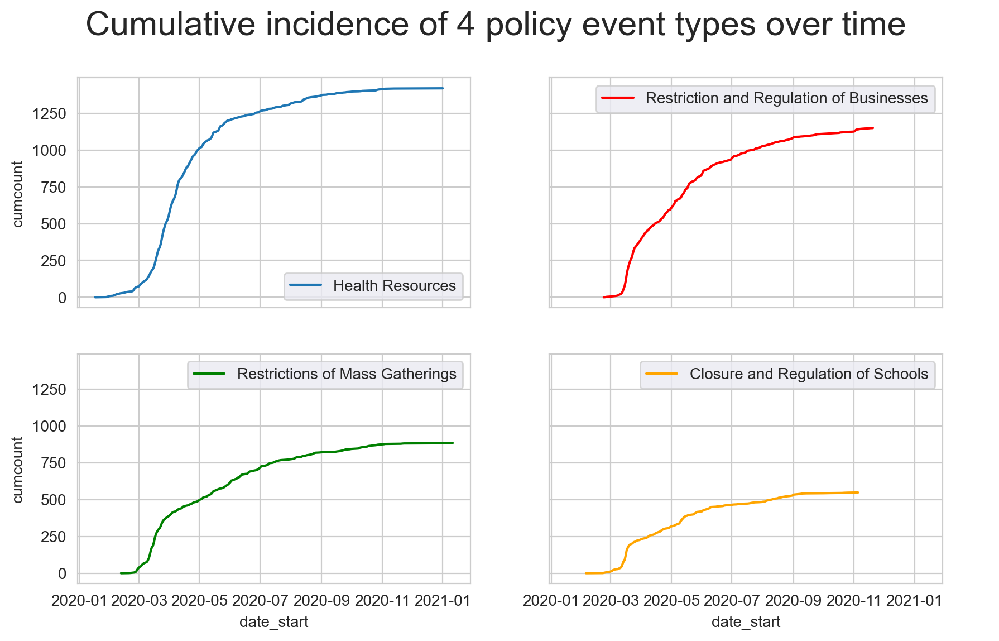
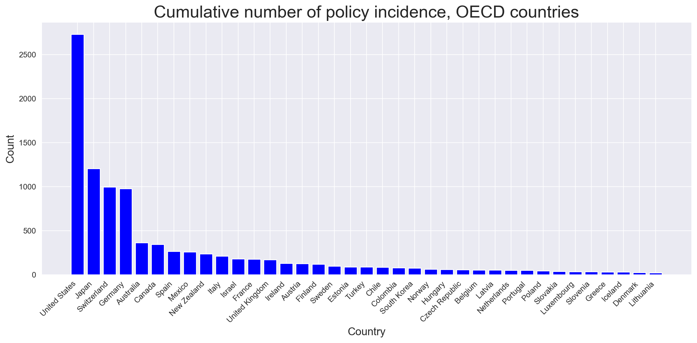
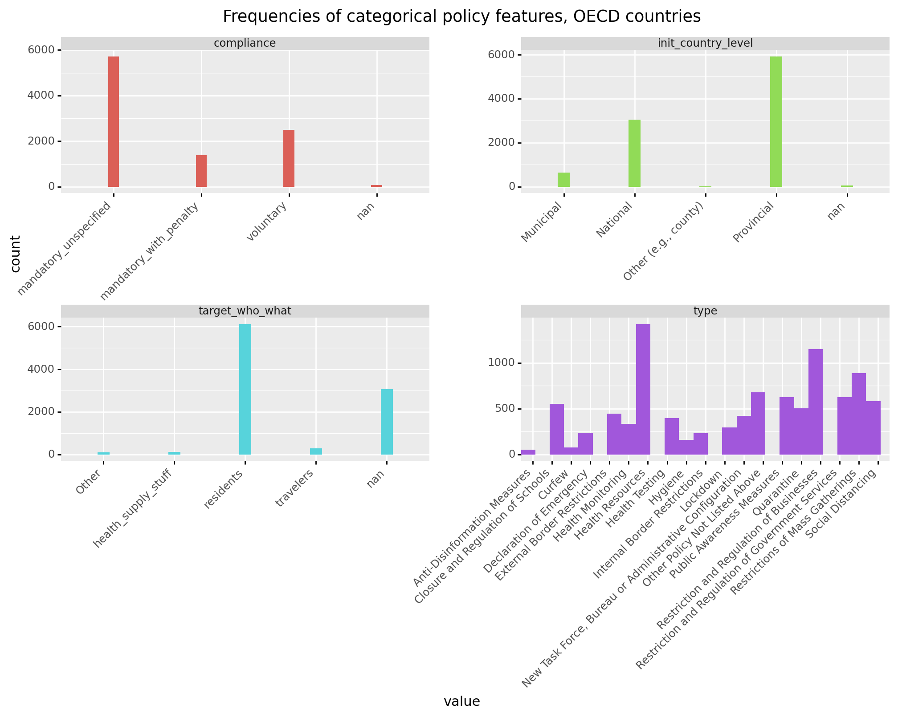
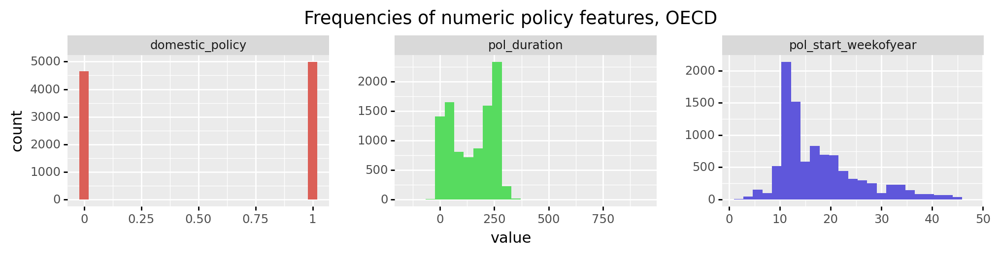
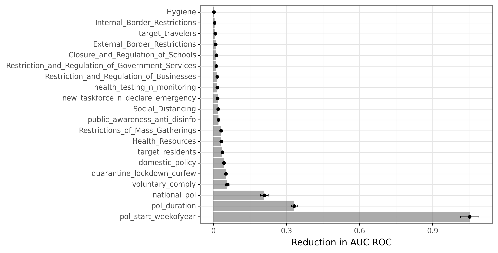
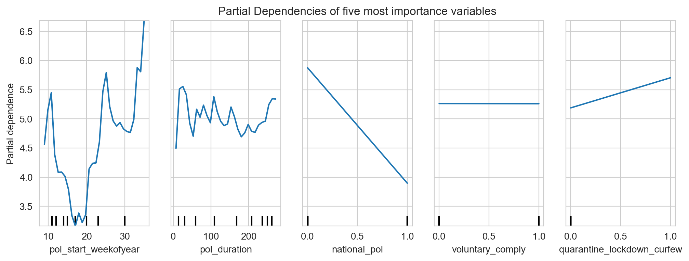
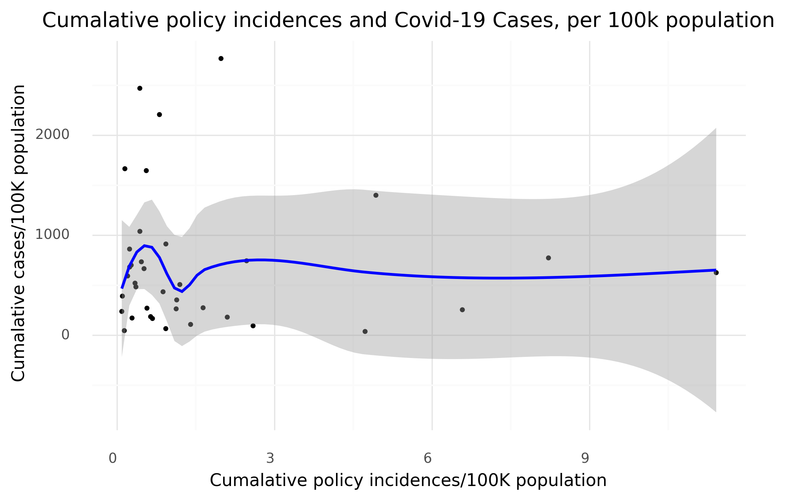
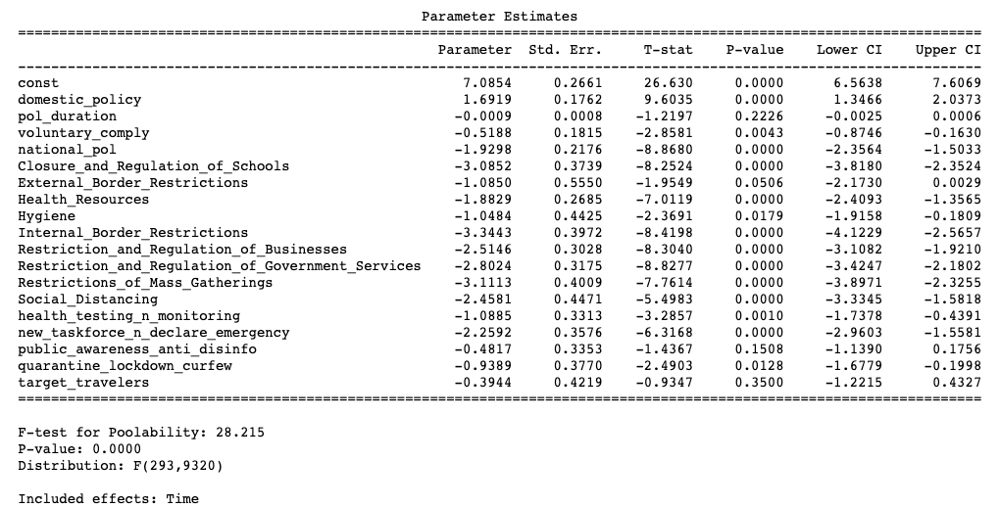
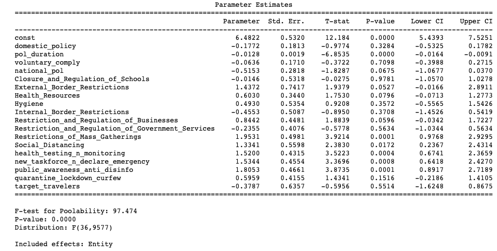
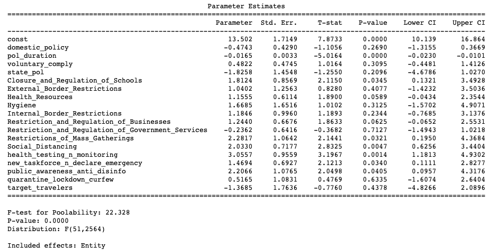

```{r setup, include=TRUE, echo=FALSE, message = FALSE, warning = FALSE}

require(knitr)
require(knitr::include_graphics())
require(haven)
require(car)
require(lmtest)
library(readxl)

opts_chunk$set(echo = TRUE)
options(digits = 3)
```

### Introduction
The main goal of this project is to analyze the effect of governments’ response to COVID-19 in Organisation for Economic Co-operation and Development (OECD) countries on COVID-19 infection rates. The project also briefly analyzes the relationship between governments’ responses and national economic performances in these countries.

First, the report shows the data sources and briefly reviews the data wrangling process. Second, the report presents the methods used, including the process of feature selection and engineering, model selection and the permutation importance. Third, the results of the predictive models and fixed effects models are presented. These models use policy features as predictors and infection rates as the response variable, for both the OECD countries and the US state level data. Fourth, a brief analysis of economic performances as a function of policy and infection rates is performed using fixed effect models.

### Problem Statement and Background
  COVID-19 pandemic in 2020 caused 45.2 million cases of infection and more than 1 million deaths globally. As the epidemiologist Gregg Gonsalves said, a pandemic is “essentially a crisis of governance, of what governments do and do not do” for their people.^[Quinn, Annalisa. “Germany has lessons about containing the damage of COVID-19. It’s not too late for us to start listening”, November 27, 2020, *Boston Globe*.] The project aims to explore policy types and features that are most effective in controlling the disease, with a focus on OECD countries. It also analyzes the relationship between number of policy incidences and economic performance. 
  
  Trang et al. found that increased “social distancing” measures were “associated with a 29% reduction in COVID-19 incidence … and a 35% reduction in COVID-19 morality” in the US ^[VoPham, Trang, et al. "Effect of social distancing on COVID-19 incidence and mortality in the US." *MedRxiv* (2020).].  Islam et al. found that employing “any physical distancing intervention”, including closure of schools or workplaces, were “associated with an overall reduction in COVID-19 incidence of 13%” based on global data.^[Islam, Nazrul, et al. "Physical distancing interventions and incidence of coronavirus disease 2019: natural experiment in 149 countries." *bmj* 370 (2020).]  Haldar and Sethi’s research showed that COVID-19 incidence are determined by “demographic factors and government policies”, while socio-economic features like GDP and human development index, “appear statistically insignificant”.^[Haldar, Anasuya, and Narayan Sethi. "The effect of country-level factors and government intervention on the incidence of COVID-19." *Asian Economics Letters* 1.2 (2020): 17804.]  Copious researchers arrived at similar conclusions that emphasize the importance of government’s reactions. Based on the existing findings, this project looks at effects of policy features that are based on more detailed categorization and uses time series data to build predictive models of national infection rates. 

### Data ^[Please see full data sources in citation.]
The government response dataset in the project is based on “COVID-19 Government Response Event Dataset (CoronaNet)” created by Cheng, C. et al. The infection and mortality time series data are based on the COVID-19 Data Repository by Johns Hopkins University Center for Systems Science and Engineering, normalized by countries’ populations data from OECD.Stat and US Census. Economic data, including quarterly real GDP growth rate and unemployment rate, comes from OECD.Stat. All datasets include data up to November 30th 2020.

The majority of the analysis uses policy incidence, contextualized in countries and dates, as unit of observation. The different temporal distribution of four examples of policy types and the number of cumulative policy incidences across countries are illustrated in Figure 1 and Figure 2 above. My variables of interest are the policy type (e.g. lockdown, health resources) and characteristics (e.g. duration, compliance) that are predictive of the infection rates. The potential issue of the policy dataset is that policies from the United States have the most representation among OECD countries. Though the number of policy is proportional to the US’s large population, because the unit of analysis is policy incidents, the relationship between policy and infection rate in the US will impact the overall trend more than other countries. Another issue is that more than half of the policies do not have a specified end date, making the calculated duration of the policy artificial. 

{width=70%}

{width=80%}


In the data wrangling process, I found that the original plan of setting country-date as unit of analysis would prevent the inclusion of many policy features, and it is hard to build a direct link between the policy features with the infection rate. Therefore, I changed the unit to policy and chose seven features according to importance and data completeness. The frequency of each variable can be seen in Figure 3 and 4. When preprocessing these features, I calculate the duration of policy and add it with the timespan of the updates on the same policy. I also conflate categories within features based on description, for example, multiple variations of target groups in *target_who_what* variable are combined as residents and travelers. The policy start date is converted into an ordinal variable indicating the week of the year. I also conflate policy types with little representations into similar policies. For instance, "Public Awareness Measures" and "Anti-Disinformation Measures" are combined into one bin before feeding it into the models.


{width=90%}


{width=90%}

A 30-day average of daily new cases with a 3-week lag is used as a measure of the effectiveness of the policy and also the outcome variable of the predictive models. So, I wrangle the original cumulative infection data into daily new cases, and normalize the daily cases in each country, by 100,000 population in the country. I then calculate a 30-day average from each date onwards and merge onto the policy dataset based on country and a lagged effect of 3 weeks. 

### Methods and Analysis
The preprocessed data is re-split into test and training datasets with test data holding 25% of the data and training data holding the rest 75%. In building the machine learning pipeline, I incorporate both the interpretable models, linear model and decision tree regressor, and often more accurate “black box” models, including K nearest neighbors, bagging, and random forest regressors. MinMaxScaler is used to scale each feature’s values to a range of 0 to 1 in preprocessing. A 10-fold cross validation is used to estimate model performance on new data during training. The pipeline assesses and selects the most predictive model based on negative mean squared error as the response variable is continuous. The best model is then used on the test data. Since the best model is bagging with a base estimator of random forest regressor, for interpretability, permutation importance method is employed to show variable importance, by randomly shuffling the value of each variable and show the reduction in model performance each time. I use partial dependency plots to visualize the top five most important variables.  

Since the project dataset is panel data and each unit (policy) is situated in certain country and date, I also run fixed effect models with policy features as predictors and infection rates as response, to control for unobserved heterogeneity among countries and across time, which is a potential source of endogeneity. Adding fixed effects is conceptually equivalent to including a dummy variable in an OLS model for each entity controlled. After running the variable correlation heatmap, I remove one dummy variable, *target_residents*, that it is 0.79 correlated with *domestic_policy*. The correlations between the other variables lie mainly around -0.2 to 0.3. I set country as the first level index in the models. Different from the treatment of the policy start date for predictive models, I preserve the exact dates as the second level index to account for time fixed effect. Additionally, I utilize cluster covariance estimators for time, controlling for autocorrelations across time. Given that the data is based on time-series, we establish that error terms are temporally correlated within countries. I use the same features and model specifications for both OECD data and the US state level policy and infection data. 

In exploring the correlation between the economic performances, policy, and infection rates, I also use a fixed effect model with country’s quarterly new cases and number of quarterly new policies (both normalized by 100,000 population) as independent variables, and the country’s quarterly real GDP growth rate of 2020 compared to the same quarter in 2019 as dependent variable. Another model takes in the same independent variables and uses quarterly unemployment rates of 2020 compared to the same quarter in 2019 as dependent variable. Each country only has data for three quarters at most, adding up to less than 110 observations. The sample size is not big enough to justify the use of predictive models. 

### Results
The most predictive model selected in the pipeline, bagging, has a mean squared error (MSE) score of 13.44 and $R^2$ score of 0.79 on the training data, but the performance reduces to a MSE score of 34.64, and an $R^2$ score of 0.41 on the test data. This indicates the overfitting issue in the model. As shown in Figure 5, permutation importance results show that week of the year when policy starts (converted from policy start date) is the most important, coming after it are policy duration, national policy (dummy), voluntary policy (dummy), and quarantine/lockdown/curfew policy. The partial dependency plots of these five features are illustrated in Figure 6. What is alarming in the results is that *pol_start_weekofyear*, with an importance mean of 1.05, is highly predictive of the response variable, while most of the policy features have less than 0.1 importance mean. Since the time-series data of infection rates has significant autocorrelation, the model has been relying heavily on the temporal aspect of policies to predict the infection rates, establishing that the policies with the same or close start weeks tend to get similar outcomes. It is possible that the start week variable soaks up other policy features’ effects on infection outcome. 

{width=90%}

{width=90%}

The disadvantages of the predictive model propel me to use PanelOLS models to control for time and country fixed effects. When accounting for time effects of each date, the results indicate a general negative correlation between policy features and infection rates, with 13 out of 17 being statistically significant at $alpha$=0.05. “Internal border restrictions” were found to have the biggest, statistically significant, negative effect with a coefficient of -3.34, indicating that this policy is associated with a 3.34 decrease in 30-day average daily cases per 100,000 population. Following it, “restrictions of mass gatherings” and “closure and regulations of schools” have coefficients of -3.11 and -3.09 respectively. The poolability F-test has a p-value of essentially 0, proving that it is correct to control for date fixed effect. (see appendix 1 for full results) Intriguingly, when accounting for country effects, only 6 policy features have a statistically significant correlation with infection rates at $alpha$=0.05. More than half of all features have a positive correlation with infection rates, the strongest positive correlation being “restrictions of mass gatherings” with a statistically significant coefficient of 1.95, followed by “public awareness and anti-disinformation measure” with a coefficient of 1.81. The strongest negative correlation is the national policy dummy, with a result of -0.52 and a t-statistic of -1.83 (significant at $alpha$=0.10).  (see appendix 2 for full results). National policy (as opposed to subnational policy) is found to be negatively correlated with infection rate across the predictive model and two fixed effects model specifications.

It is curious that after controlling for country fixed effects, more than half of the policy features appear to increase infection rates. Given that the US has predominantly state level policies, there is a potential disconnect between the policy incidences and the responding national infection rates for the US observations. Therefore, I wrangled state level policy and infection rate data (normalized by state population) of the US. The US data is processed in the same way as OECD data, except the national policy dummy is changed to state policy dummy (1 indicating state policy, 0 indicating municipal and county policy). The state level of data is fed into the fixed effect models to inspect specific correlations in the US. When controlling for state fixed effects, state policy appears to have the strongest negative correlation with infection (coefficient -1.83) but the result is not statistically significant, the only statistically significant negative relation being policy duration (coefficient -0.02). 6 out of 13 features that are positive correlated with infection are statistically significant, with “health testing and monitoring” having the greatest coefficient, 3.06. Please see appendix 3 for full results of this entity-effects model.

\begin{table}[]
\centering
\caption{Fixed Effects Models for Economic Performance}
\label{tab:Satisfied}
\begin{tabular}{|l|c|c|c|}
\hline
  & \multicolumn{ 1 }{ c }{ Y = GDP } & \multicolumn{ 1 }{ c }{Y=unemploy} &\\ \hline
Quarterly cases         & $-$0.0003  & 0.0017$^*$    \\
                        & (0.001)    & (0.0005)   \\
                        &$[t =-0.26]$&$[t = 3.38]$   \\[4.5pt]
Quarterly policies      &0.2845     & $-$0.0225  \\
                        & (0.39)      & (0.19)   \\
                        &$[t = 0.72]$ &$[t = -0.12]$   \\[4.5pt]
Constant                &  $-$2.5206$^*$     & 0.5655$^*$   \\
                        & (0.47)      & (0.23)   \\
                        &$[t =-5.33]$  &$[t = 2.42]$   \\[4.5pt]
$N$                     & 98          & 105        \\[4.5pt]
$R^2$                   & 0.006      & 0.103     \\ \hline
\multicolumn{4}{l}{\footnotesize{Standard errors in parentheses}}\\
\multicolumn{4}{l}{\footnotesize{$^*$ indicates significance at $p< 0.05 $}} 
\end{tabular}
\end{table}


The results of the models for change in GDP and unemployment rate controlling for time fixed effect are presented in the table below. Numbers of quarterly new COVID-19 cases and quarterly new policies are both normalized by population, but are not standardized around mean. I did not choose the country effects specification because the p-value of F-test is too high to reject the poolability null, suggesting insignificant heterogeneity in economic performances across countries. This is partially because the quarterly GDP growth rate and unemployment rate are both compared to the country’s 2019 data in the same quarter (e.g. Q1-2020 unemployment rate subtracted by Q1-2019 unemployment rate), so the baseline difference across countries is controlled. Quarterly new cases appear to be negatively correlated with change in quarterly real GDP growth rate (increasing the magnitude of GDP decline), and number of quarterly policy incidences appear to have positive correlation with change in quarterly GDP growth rate (decreasing the magnitude of GDP decline). But neither correlations are statistically significant. The results also show that quarterly new cases have a statistically significant (at $alpha$=0.01), positive correlation with change in unemployment rate (further increasing the rising unemployment rate), and number of quarterly policy incidences appear to be negatively correlated with the change in quarterly unemployment rate (decreasing the unemployment rate). 

The scatterplot in Figure 6 shows the correlation between cumulative policy incidences and cumulative COVID cases up until the end of Q3 2020, normalized by population. There is insignificant correlation. 

{width=90%}

### Discussion
I was able to successfully wrangle the data available to plot the temporal distribution of cumulative policy incidents by policy types and build a predictive model using policy features as predictors of COVID-19 infection rates. I also looked into the correlations between policy types and infection rate outcomes in fixed effect models. In addition to this, I ran the fixed effect model with economic performance as a function of policy incidence and infections, and showed their correlations. National policy (as opposed to subnational policy) is negatively correlated with infection rate across models. However, other results are underwhelming, as policy features that are not related to the temporal aspect appear to be insignificant in predictive models. Given the limited knowledge I have in statistical learning, the models I built are subject to the autocorrelation issue.  In different fixed effect model specifications, the coefficients on policy features change from negative to positive, making their effects on infection rate ambiguous. Though the fixed effect models show that COVID-19 related policy incidences have positive effects on economic performance, the results are not statistically significant. The goals of the project are not fully achieved.

If given more time, I would try to deal with the intrinsic issues of time-series data and explore better ways to measure the effect of policies. I would also combine Oxford University’s COVID-19 government response tracker for further analysis, as it includes economic policies, such as income support for households, debt/contract relief, international support, etc.

### Citation 
1. Cheng, C., Barcelo, J., Hartnett, A.S., Kubinec, R., & Messerschmidt, L. (2020). CoronaNet—Tracking governments COVID-19 responses. https://www.coronanet-project.org.
2. US Census, https://www.census.gov/topics/population.html
3. OECD.Stat, “Quarterly GDP”, https://data.oecd.org/gdp/quarterly-gdp.htm. “Unemployment Rate”, https://data.oecd.org/unemp/unemployment-rate.htm#indicator-chart
4. COVID-19 Data Repository by the Center for Systems Science and Engineering (CSSE) at Johns Hopkins University. https://github.com/CSSEGISandData/COVID- 19


5. Quinn, Annalisa. “Germany has lessons about containing the damage of COVID-19. It’s not too late for us to start listening”, November 27, 2020, *Boston Globe*.
6. VoPham, Trang, et al. "Effect of social distancing on COVID-19 incidence and mortality in the US." *MedRxiv* (2020).
7. Islam, Nazrul, et al. "Physical distancing interventions and incidence of coronavirus disease 2019: natural experiment in 149 countries." *bmj* 370 (2020).
8. Haldar, Anasuya, and Narayan Sethi. "The effect of country-level factors and government intervention on the incidence of COVID-19." *Asian Economics Letters* 1.2 (2020): 17804.

### Appendix: Fixed Effect Models Results

{width=90%}

{width=90%}

{width=90%}

